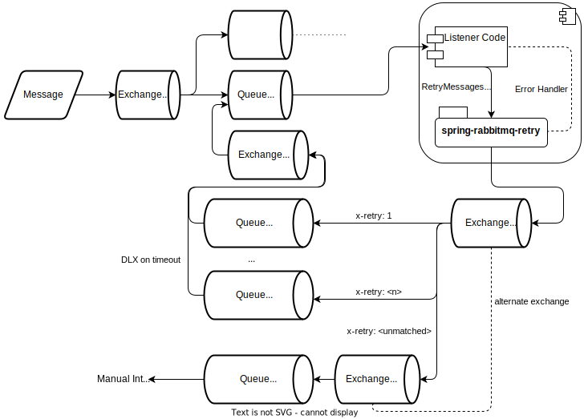

# Spring RabbitMQ Retry

Retries and exponential backoff for Spring AMQP.

## Motivation

When using Spring RabbitMQ, a listener might look like this:

```java
class MyListener {
    @RabbitListener(queues = "foo")
    public void handle(Message<MyMessage> msg) {
        processMessage(msg);
    }
}
```

By default, any exception thrown in the listener will immediately lead to the message being requeued. In many cases
exceptions are caused by either malformed messages or unavailable backends. In both cases, requeuing the message will
not help. If a backend is unavailable due to being overloaded, this behavior is harmful.

A solution to this problem is exponential backoff. A message will not be retried immediately, but after some delay. For
each failure, the delay is increased exponentially, until a maximum number of retries is reached. Then, the message is
sent to a dead letter queue for manual intervention.

## Message Flow



A message is sent to the `in` exchange via AMQP. It is then routed to a number of queues. One of them is the queue
`foo`, that we will use for this example. There is a Spring application with a listener on `foo`. Some minimal listener
code might look like this:

```java
class MyListener {
    @RabbitListener(queues = "foo")
    public void handle(Message<MyMessage> msg) {
        try {
            processMessage(msg);
        } catch (BackendTimeoutExceptoin e) {
            // Backend will probably come back. Retry.
            throw new RetryMessagesException(msg);
        } catch (MalformedMessageException e) {
            // The message will not be fixed by retrying...
            // Log and discard.
        }
    }
}
```

This library will handle `RetryMessagesExceptions` thrown by listeners, using the flow depicted above:

The message is sent to a retry exchange, dedicated to the original queue (`foo-retry`) with a header indicating the
number of previous attempts plus one. The retry exchange routes the message based on the retry header. 

If the retry attempts are exhausted, and the message cannot be routed, the alternate exchange is used, which just routes
the message to a dead letter queue (`foo-retry-never`) for manual intervention.

The retry queues have a timeout configured, that will dead letter the message. However, the dead letter exchange is
`foo-dispatch`, that will just route the message back to the original queue.

## Publishing

Spring RabbitMQ Retry is published to the central maven repository.

Usually, publishing happens automatically via GitHub Actions. However, if you are an employee of jaconi, you can also
publish releases manually. To publish a release, you will need to configure the GPG private signing key and the keys
passphrase:

```
export ORG_GRADLE_PROJECT_signingKey=<GPG signing key>
export ORG_GRADLE_PROJECT_signingPassword=<GPG signing key passphrase>
```

If you are having issues setting the multiline signing key as an environment variable, you can use Base64 encoding.

Additionally, you will need credentials for [https://s01.oss.sonatype.org](https://s01.oss.sonatype.org). Configure
these in `~/.gradle/gradle.properties` like this:

```
ossrhUsername=<username>
ossrhPassword=<password>
```

Once everything is set up, you should be able to publish snapshots using

```
./gradlew publish
```

If your [https://s01.oss.sonatype.org](https://s01.oss.sonatype.org) credentials do not have sufficient privileges,
create a ticket for manual approval, as described here:
[https://central.sonatype.org/publish/manage-permissions/](https://central.sonatype.org/publish/manage-permissions/)
